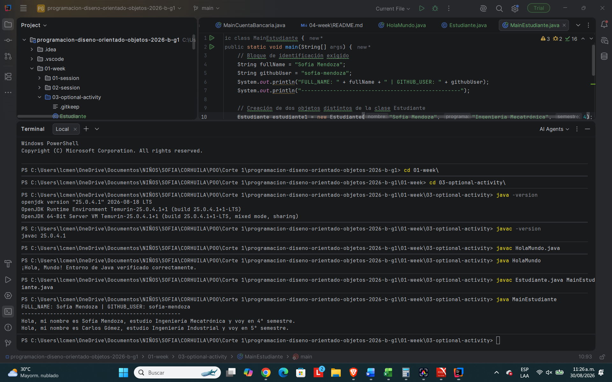

# Actividad Semana 01 - Entorno Java y POO

**Estudiante:** Sofía Mendoza  
**Usuario de GitHub:** sofia-mendoza

---

## Parte A: Verificación de Entorno de Ejecución

Comandos ejecutados en la terminal para compilar y ejecutar los programas:

```bash
# Verificación de versiones
java -version
javac -version

# Compilación y ejecución de HolaMundo
javac HolaMundo.java
java HolaMundo

# Compilación y ejecución del programa principal
javac Estudiante.java MainEstudiante.java
java MainEstudiante


```

## Parte C: Modelado de Dominio Real y Abstracción
Dominio Seleccionado: Tienda de Comercio Electrónico (E-Commerce)

1. Clase Producto
Atributos: codigo, nombre, precio, stock.

Métodos: actualizarPrecio(), reducirStock(), aumentarStock().

Abstracción (Qué se dejó fuera): Se omitieron detalles físicos como peso, dimensiones del paquete, fabricante secundario y fecha de elaboración, ya que no son relevantes para el flujo básico de compra y control de inventario digital.

2. Clase Cliente
Atributos: idCliente, nombre, correo, direccionEnvio.

Métodos: realizarPedido(), actualizarDireccion().

Abstracción (Qué se dejó fuera): Se excluyeron características biológicas o personales irrelevantes como estatura, estado civil, preferencias musicales o historial crediticio externo.

3. Clase Pedido
Atributos: idPedido, fecha, estado, montoTotal.

Métodos: calcularTotal(), cambiarEstado(), cancelarPedido().

Abstracción (Qué se dejó fuera): Se dejaron fuera aspectos operativos detallados como el nombre del chofer de la empresa de mensajería, la placa del vehículo repartidor o la ruta GPS exacta tomada durante la entrega.